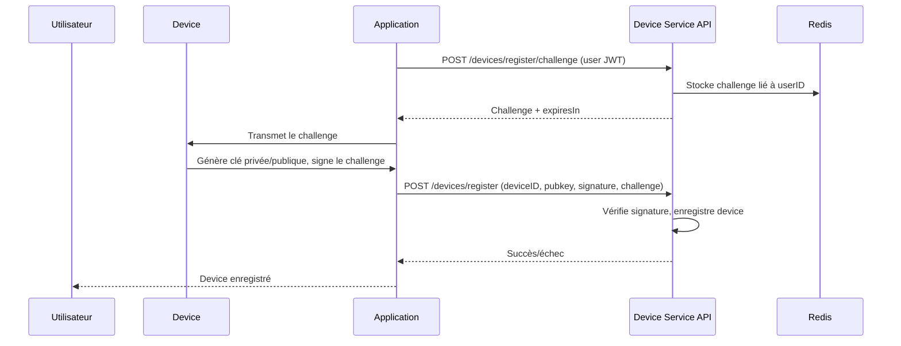

# Enregistrement d’un device (Device Enrollment)

## 1. Principe général

L’enregistrement d’un device consiste à :
- Générer un challenge côté serveur, lié à l’utilisateur.
- Le device génère une paire de clés (privée/publique), signe le challenge avec la clé privée.
- Le client envoie la clé publique, le challenge et la signature au serveur.
- Le serveur vérifie la signature et enregistre le device.

---

## 2. Diagramme du process



---

## 3. Pseudo-code cryptographique

### Génération de la clé et signature

```
# Générer une paire de clés (ex: ECDSA)
privKey, pubKey = generateKeyPair()

# Signer le challenge
signature = sign(privKey, challenge)
```

### Vérification côté serveur

```
# Vérifier la signature
isValid = verify(pubKey, challenge, signature)
if isValid:
    enregistrerDevice(pubKey, userID)
```

---

## 4. Exemple JavaScript (WebCrypto)

```js
// Générer une clé ECDSA
const keyPair = await window.crypto.subtle.generateKey(
  { name: "ECDSA", namedCurve: "P-256" },
  true,
  ["sign", "verify"]
);

// Exporter la clé publique
const publicKeyJwk = await window.crypto.subtle.exportKey("jwk", keyPair.publicKey);

// Signer le challenge
const encoder = new TextEncoder();
const data = encoder.encode(challenge);
const signature = await window.crypto.subtle.sign(
  { name: "ECDSA", hash: "SHA-256" },
  keyPair.privateKey,
  data
);
```

---

## 5. Appels HTTP

### Obtenir un challenge

```bash
curl -H "Authorization: Bearer <JWT>" \
     -X POST https://api.example.com/devices/register/challenge
```

### Enregistrer le device

```bash
curl -H "Authorization: Bearer <JWT>" \
     -H "Content-Type: application/json" \
     -X POST https://api.example.com/devices/register \
     -d '{
           "device_id": "device123",
           "public_key": "<clé_publique>",
           "challenge": "<challenge>",
           "signature": "<signature>"
         }'
```

### Exemple JS (fetch)

```js
// Obtenir le challenge
const resp = await fetch('/devices/register/challenge', {
  method: 'POST',
  headers: { Authorization: 'Bearer ' + jwt }
});
const { challenge } = await resp.json();

// Enregistrer le device
await fetch('/devices/register', {
  method: 'POST',
  headers: {
    Authorization: 'Bearer ' + jwt,
    'Content-Type': 'application/json'
  },
  body: JSON.stringify({
    device_id: 'device123',
    public_key: exportedPubKey,
    challenge,
    signature: arrayBufferToBase64(signature)
  })
});
```

---

## 6. Recommandations de sécurité

- **Protéger la clé privée** : Ne jamais exposer la clé privée, la stocker dans un espace sécurisé (Secure Enclave, KeyStore, etc.).
- **Utiliser le TPM ou Secure Element si possible** : Privilégier le stockage matériel pour la clé privée (TPM, Secure Enclave, Android Keystore…).
- **Ne jamais transmettre la clé privée** : Seule la clé publique doit être envoyée au serveur.
- **Vérifier la source du challenge** : Toujours utiliser un challenge généré par le serveur pour éviter les attaques de rejeu.

---

N’hésitez pas à demander des exemples adaptés à votre stack ou des précisions sur la sécurité.

---

## 7. Appels API avec headers X-Device-*

Certaines routes nécessitent que le device prouve son identité à chaque appel via des headers spécifiques :

- `X-Device-ID` : identifiant du device
- `X-Device-Nonce` : nonce fourni par le serveur (challenge)
- `X-Device-Timestamp` : timestamp de la signature
- `X-Device-Signature` : signature du challenge/timestamp avec la clé privée du device

### Exemple curl

```bash
curl -X GET https://api.example.com/devices/status \
     -H "Authorization: Bearer <JWT>" \
     -H "X-Device-ID: device123" \
     -H "X-Device-Nonce: <nonce>" \
     -H "X-Device-Timestamp: <timestamp>" \
     -H "X-Device-Signature: <signature>"
```

### Exemple JavaScript (fetch)

```js
await fetch('/devices/status', {
  method: 'GET',
  headers: {
    Authorization: 'Bearer ' + jwt,
    'X-Device-ID': deviceId,
    'X-Device-Nonce': nonce,
    'X-Device-Timestamp': timestamp,
    'X-Device-Signature': signature
  }
});
```

---

## 8. Pending approval & code de vérification

Après l’enregistrement, certains devices nécessitent une approbation manuelle (pending approval) :

1. L’admin reçoit une notification ou voit le device en attente dans l’interface d’administration.
2. Un code de vérification (ex : 6 chiffres) est généré et envoyé à l’utilisateur (par email ou autre canal sécurisé).
3. L’utilisateur doit saisir ce code dans l’application pour finaliser l’activation du device.

### Exemple de flow

1. L’utilisateur enregistre son device (voir étapes précédentes).
2. Le backend répond :

```json
{
  "pending_approval": true,
  "approval_code_required": true
}
```

3. L’utilisateur reçoit le code (par email, SMS, etc.)
4. Il appelle l’API pour valider le code :

```bash
curl -X POST https://api.example.com/devices/device123/approve \
     -H "Authorization: Bearer <JWT>" \
     -H "Content-Type: application/json" \
     -d '{ "approval_code": "123456" }'
```

### Exemple JS

```js
await fetch(`/devices/${deviceId}/approve`, {
  method: 'POST',
  headers: {
    Authorization: 'Bearer ' + jwt,
    'Content-Type': 'application/json'
  },
  body: JSON.stringify({ approval_code: code })
});
```

Si le code est correct, le device est activé et utilisable.

---

## 9. Découverte (discover) et authentification OIDC/OAuth2

### Découverte (discover)

La phase de découverte permet à l’application ou au device de récupérer dynamiquement les informations nécessaires pour interagir avec le serveur d’authentification (OIDC/OAuth2). Cela se fait généralement via une URL bien connue :

- `/.well-known/openid-configuration`

Exemple :

```bash
curl https://auth.example.com/.well-known/openid-configuration
```

La réponse contient les endpoints (authorization, token, userinfo…), les scopes supportés, les clés publiques du serveur, etc.

### Authentification OIDC/OAuth2

OIDC (OpenID Connect) et OAuth2 sont des protocoles standards pour l’authentification et l’autorisation.

#### Flow typique (Authorization Code)

1. L’application redirige l’utilisateur vers l’URL d’autorisation :
   - `https://auth.example.com/authorize?client_id=...&redirect_uri=...&scope=openid+profile&response_type=code`
2. L’utilisateur s’authentifie (login/password, MFA…)
3. Le serveur d’auth retourne un code d’autorisation à l’application (via redirect_uri)
4. L’application échange ce code contre un access_token (et éventuellement un id_token) :

```bash
curl -X POST https://auth.example.com/token \
     -d 'grant_type=authorization_code&code=<code>&redirect_uri=<redirect_uri>&client_id=<client_id>&client_secret=<secret>'
```

5. L’application reçoit un access_token (JWT) à utiliser dans les appels API (header `Authorization: Bearer ...`)

#### Exemple JS (PKCE)

```js
// Générer un code_verifier et code_challenge (PKCE)
// Rediriger l’utilisateur vers l’URL d’authentification
window.location = `https://auth.example.com/authorize?client_id=...&redirect_uri=...&scope=openid&response_type=code&code_challenge=${codeChallenge}&code_challenge_method=S256`;

// Après redirection, échanger le code contre un token
const resp = await fetch('https://auth.example.com/token', {
  method: 'POST',
  headers: { 'Content-Type': 'application/x-www-form-urlencoded' },
  body: new URLSearchParams({
    grant_type: 'authorization_code',
    code,
    redirect_uri,
    client_id,
    code_verifier
  })
});
const tokens = await resp.json();
```

#### Points importants
- Toujours utiliser HTTPS pour tous les échanges.
- Ne jamais exposer le client_secret côté frontend/mobile.
- Le token JWT reçu doit être envoyé dans le header Authorization pour authentifier les appels API.
